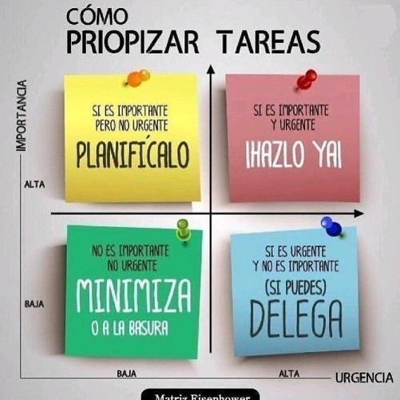
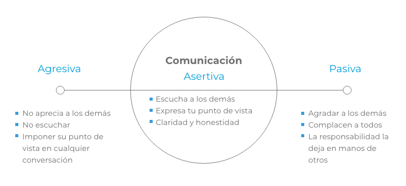

# Fundamentos de la gestión del tiempo

Aprende en este curso a organizarte mejor para disponer de más tiempo de calidad en el que desarrollar tus objetivos y expectativas. Descubre trucos, herramientas, métodos y acciones específicas dirigidas a la mejora de tu eficacia y tu bienestar general, con los que serás capar de tomar mejores decisiones. Mantén más control sobre las tareas a las que dedicas tu tiempo, trabaja tu disciplina, perseverancia y responsabilidad individual, y sustituye el modo reactivo de actuar por el modo reflexivo.

# 1. Conceptos Imprescindibles de optimizacion de tiempo

## **Valor frente a volumen**

Centrarse en lo importante dejar lo superficial.

No todas las tareas son iguales hay tareas cuya prioridad de ejecucion esta por encima de las demas. A mayor calida mayor importancia a mayor importancia mayor prioridad de accion.

La urgencia puede ser un indicador de prioridad pero muchas veces es un indicativo de poca capacidad de planificacion y estres si se mantiene en el futuro.

Aprendamos a planificar.

## **Menos cosas mejor ejecutadas**

Nos encontramos en la decada de Trabajar más, consumir más, ganar más, gastar más, hacer más, porque es mejor. Y, sin embargo, la mayoría de las veces, más solo significa mayor cantidad, y, únicamente, "lo mejor" tiene significado de "excelente". Hacer más no significa ser más productivo, ni más eficiente. Solo significa hacer más.

"Menos es más" habla de la sencillez y de cómo lo sencillo es el resultado de un buen esfuerzo intelectual.

Parece que está bastante claro que sencillo no equivale a simplista. La simplificación consiste en no dejarse llevar por la fuerza bruta y tirar con todo hacia delante, sino buscar y construir modos de ser más eficiente. Hacer las cosas simples requiere de un gran esfuerzo. Responder a la pregunta: "¿De qué modo podríamos hacer que esto resultara más sencillo?", requiere, como he dicho, de un buen esfuerzo intelectual.

La idea principal que quiero transmitir con este bloque es que una gestión del tiempo verdaderamente óptima consiste en hacer menos cosas, y esas menos cosas hacerlas mejor y más sencillas, porque nuestra atención, nuestra fuerza y nuestros recursos son limitados. Parece, pues, que lo más apropiado es escoger dónde, cómo y en qué gastamos nuestras fuerzas para obtener esos resultados óptimos deseados.

"Quien mucho abarca poco aprieta", lleva implícita una advertencia: más vale concentrarnos en un número de tareas que nos resulten manejables, y a las cuales podamos conceder la atención que requieren, que intentar gestionar demasiadas cosas que luego no podamos controlar ni atender debidamente. Todo lo demás sobra. Desprendámonos, pues, de las cargas superficiales.

# 2. Acciones específicas en la optimización del tiempo

## **Tareas (como producto o como actividad)**

Aprender qué son las tareas, cómo enunciarlas, cómo usarlas en tu beneficio para que te sirvan de guía, saber categorizarlas, definirlas, expresarlas y asignarles una duración determinada, es clave para una gestión del tiempo sobresaliente.

Trata de escribir tus tareas como acciones concisas, tal y como explica David Allen, el gurú de la gestión de tareas. Por ejemplo, en lugar de escribir "buscar fontanero", mejor escribe algo del tipo "llamar a los tres fontaneros con mejores reseñas en Yelp". O, en lugar de "empezar un estudio para Begoña", mucho mejor enunciarlo "recopilar y filtrar la información relevante sobre X y Z, para entregársela a Begoña". Vamos a ponerlo más fácil. Cuando tengas que hacer una tarea, hazte la siguiente pregunta: ¿Si quiero completar esta tarea, qué es lo primero que debo hacer? Y ahí lo tienes. Ese es tu primer paso, y es precisamente tu nueva tarea, tal y como has de enunciarla.

Al enunciar tus tareas como acciones, no solo estás proporcionando indicaciones claras sobre qué es exactamente lo que tienes que hacer en cada momento, sino que además puedes identificar tus tareas como las partes más pequeñas en las que se dividen otras tareas mayores.

Para facilitar la clasificación de nuestras tareas, propongo diferenciar las tareas atendiendo a la naturaleza de su ejecución. Si son acciones sostenidas durante un tiempo, las llamaremos **actividades** . Sin son acciones, con cuya ejecución obtenemos un resultado, las llamaremos **productos** . Por ejemplo, meditar durante 20 minutos, leer durante media hora o hacer 45 minutos de cardio son actividades. Entregar tres presupuestos completos, llamar a la delegación de Buenos Aires o escribir un artículo sobre los usos y costumbres de la almeja atlántica son productos.

La psicología nos explica que cuando sentimos la obligación de entregar un producto, un resultado determinado, tendemos a ver la tarea como algo engorroso, generando cierto rechazo y ansiedad, por lo que en muchas ocasiones solemos evitar ponernos con ella, ideando mil maneras para retrasar su ejecución. Esto es lo que se conoce como procrastinación. Un método efectivo para evitar esa leve sensación de ansiedad o rechazo, y la procrastinación que lleva emparejada, **_es convertir las tareas tipo producto en tareas tipo actividades. La manera más simple es acotar la tarea en el tiempo_**, sin la obligación de haber acabado la tarea una vez finalice ese tiempo que hemos decidido dedicarle. Por ejemplo, la tarea "elaborar los presupuestos del 2017", que es un producto, puede enunciarse como: "dedicar 50 minutos a la elaboración de los presupuestos del 2017", y, así, se convierte en una actividad.

Lo que importa en este caso no es que finalices los presupuestos, sino que les dediques 50 minutos de tu tiempo para avanzar hasta donde te sea posible. No importa que no acabes, importa que te pongas con ello un rato, y al día siguiente otro poco. Y, así, poquito a poquito, consigues un muchito que resulta en la tarea finalizada con gusto, y prestándole la suficiente atención.

Que si bien lo que se persigue es un producto, limitamos la actividad en el tiempo, poniendo la atención al tiempo en el que ejecutamos la tarea, y no al resultado final. Esto puede ayudarnos a enfrentarnos a tareas complicadas, aunque puedan llevarnos mucho, de manera más sensata y calmada. El objetivo no es acabar los tres presupuestos, sino dedicar 20 minutos a elaborarlo. Si no has acabado, puedes programar más tiempo en otro momento.

## **Qué son las listas de tareas**

Las listas de tareas son una herramienta para ir apuntando cosas que quieres, debes o podrías hacer. Si lo miramos bien, estas listas son en verdad una expansión de nuestra memoria, pues al usarlas liberamos espacio y recursos en nuestra cabeza.

El sistema que yo prefiero utilizar se basa en tres principios: la lista ha de ser:

- sencilla
- breve
- colocando los elementos por orden de importancia.

## **Optimiza tu tiempo con estas cuatro listas**

La manera la que yo propongo trabajar se basa en cuatro listas que respetan esos principios fundamentales de una lista de tareas efectiva:

- TODAS
- PRIORIDADES
- HOY
- REALIZADAS

Vamos con la lista **"Todas"**. Esta lista es una extensión de tu cerebro. Aquí entra, como su nombre dice, todo lo que querrías, deberías o podrías hacer. Saca de tu mente todas las cosas que tengas pendientes y con esta lista acabas de aumentar tu capacidad de concentración un 1%, librándole de pensamientos rumiantes que van y vienen y molestan.

Una vez que tengas esta lista escrita, apártatela. Si esta lista la tienes presente frecuentemente, lo único que conseguirás es generarte frustración y ansia, ya que tu atención se centrará, precisamente, en esas tareas pendientes. Así que, ni las mires hasta que sea necesario ir a seleccionar, de entre ellas, cuáles serán tus siguientes tareas a ejecutar.

De lo que se trata con esta herramienta, es de que tengas la posibilidad de hacer un repaso a todas las tareas cuando tú quieras, sin necesidad de que anden dando vueltas en tu cabeza, constantemente.

Atendemos ahora a la lista **"Prioridades"**. Es la lista de las tres tareas más importantes que te comprometes a realizar cada día y conviene que su importancia se base en la capacidad que tienen para conducirte hacia aquello que te hayas propuesto.

Vamos con la lista **"Hoy"**. Esta es una lista viva. Aquí apuntamos las tareas que nos van surgiendo a lo largo del día, por las propias dinámicas de nuestros trabajos y nuestras vidas. Lo ideal sería considerar esta lista como una lista de tareas entrantes a realizar después de las prioridades. Aunque esto no siempre es posible, porque, por ejemplo, alguna de estas tareas suelen tener ese terrible carácter de "urgente".

Por lo tanto, mi consejo, es que según vayan apareciendo tareas durante tu día las apuntes en la lista "Hoy", apartes un par de horas hacia el final del día para resolverlas todas juntas atacándolas en bloques similares, de categorías similares. Resumiendo: ve poniendo todas estas tareas entrantes urgentes en la lista "Hoy" y céntrate en resolver tu lista de prioridades. Al acercarse el final del día dedícale un tiempo a resolver esas tareas urgentes entrantes.

La lista de tareas, que denominaremos **"Hechas"**, es otra lista esencial, importantísima, pues es la que nos proporcionará sentimiento de plenitud y de haber realizado nuestro trabajo correctamente.

El proceso es: lista "Todas"; de esa lista sacamos las prioridades. Además, tenemos una lista de tareas llamada "Hoy" para las tareas que van surgiendo a lo largo del día junto a todas aquellas, que sin ser prioridades, somos capaces de ir haciendo sacándolas de la lista "Todo". Mantenemos un histórico de absolutamente todas las tareas que vayamos completando, y la llamamos "Realizadas".

## **Aprender a priorizar**

Evidentemente, no todas las tareas son iguales, sino que hay algunas más importantes que otras. Y, ahora, dado que las tareas más importantes tienen prioridad de ejecución, a estas tareas las llamaremos, precisamente, "prioridades".

Para mí, el mejor momento en el que identificar y decidir tus tareas más importantes es el final de cada día. De hecho, suele ser la última decisión que tomo antes de finalizar mi jornada. ¿Por qué? Personalmente, no quiero que mi primera tarea cada mañana sea decidir qué será lo siguiente con lo que me tengo que poner.

Además de la prioridad, es conveniente que escojas 2 o 3 tareas más, a las que puedes llamar "objetivos del día". Lo que ocurrirá una vez que hagas esto, es que la tarde anterior dejarías ya programado el comienzo de tu día siguiente.

Concéntrate en realizar estas dos tareas de manera excelente, lo mejor posible. No se trata de una carrera contrarreloj, sino de una labor de excelencia. Esto es absolutamente necesario para una óptima gestión del tiempo. No se trata de hacer más, sino se trata de hacer con más calidad.

Para cuando hayas acabado tu prioridad y tus dos objetivos, sabrás que tu día ha sido muy productivo; tu trabajo, efectivo, porque has hecho aquello imprescindible e importante, para llegar a donde tú te has marcado.

## **Las prioridades de cada día (cuadrante de tareas)**

Cuando al final del día vayas a decidir tus tres prioridades del día siguiente, puede ocurrir que no estés seguro de la idoneidad o de la importancia de las tareas que has escogido.

Por lo tanto, si dudas o consideras que hay algo más importante que estas tres tareas, has de recalibrar tus opciones y categorizar apropiadamente.

Si te pasa esto, antes de determinar cuáles eran tus prioridades quizá te ayude hacerte alguna de estas preguntas:

- ¿Cuáles son los motivos que me llevan a escoger esta actividad como una de las prioridades de mañana?
- ¿Esta tarea de qué modo me ayuda a conseguir mis objetivos?

Un método sencillo y eficaz para clasificar las tareas pendientes de acuerdo a su jerarquía se conoce como cuadrante de tareas o matriz Eisenhower. El cuadrante de tareas es un sistema para determinar tus prioridades y dejar de tener la sensación de que todo es urgente y necesario. Dibuja dos ejes, uno para la importancia y otro para la urgencia, de menos a más.

Pasa completamente de las tareas que no son ni importantes ni urgentes. Delega o aplaza sin remordimientos las cosas que son urgentes, pero no importantes; y evita que las cosas importantes se conviertan también en urgentes.

Evidentemente, la atención va hacia lo importante y lo urgente, pero la magia, donde ocurre, es en lo que es importante, pero no requiere que se haga inmediatamente. Trata de trabajar la mayor cantidad de tiempo posible en esa parte mágica del cuadrante, es decir, trata de trabajar la mayor parte del tiempo en las tareas, que no siendo urgentes, son importantes. Con la práctica, pocas cosas serán importantes y urgentes a la vez, porque habrás estado trabajando específicamente en tus prioridades de manera habitual, ordenada y constantemente, y toda la carga de trabajo la habrás trasladado hacia el cuadrante "importante, no urgente".

. Ahora, ya puedes decidir con seguridad qué tres tareas serán tus prioridades para ejecutar mañana, y, también, qué tres prioridades serán las de la semana que viene. Has escogido tus prioridades del día, ha llegado el día y las has completado. Ahora es el momento de continuar con otras tareas pendientes. Mi proceso es continuar con las tareas que considero urgentes. Y una vez que he terminado esas, seguir con al menos una tarea que me apasione. Todas estas tareas que voy realizando tras las prioridades, las voy pasando de la lista donde están anotadas a la lista tareas del día, una a una, y según las acabo, las voy tachando. Y te aseguro que con cada tachar, tengo un subidón de endorfinas por el placer que proporciona el trabajo bien hecho.

## **El cierre del día**

Las tareas pendientes son fuente de ansiedad, estrés y frustración, porque nuestra mente tiende a recordarnos, sin que la invitemos y sin que queramos, que tenemos cosas aún por hacer. Los humanos recordamos mejor las tareas que tenemos pendientes que las que ya hemos realizado ( efecto Zeigarnik: la tendencia que tenemos a recordar mejor tareas pendientes que tareas completadas)

El efecto Ovsiankina habla de cómo nuestra mente nos recuerda de manera constante que tenemos tareas pendientes. Es decir, si interrumpimos la ejecución de una tarea, nuestra mente nos recordará una y otra vez que tenemos algo que hacer. "¡Hey!, que tienes esto pendiente".

Para evitar estos efectos perniciosos, además de utilizar listas de tareas que funcionan como una extensión de nuestro cerebro al ser un volcado de datos en forma de tareas que queremos, debemos o podemos hacer, cabe la posibilidad de desarrollar un ritual de cierre de jornada que nos ayude a vencerlos.

Mi ritual consiste en tres partes: en primer lugar,

- un repaso de la listas Hoy y Prioridades;
- después me pregunto ¿qué he aprendido hoy?;
- y, por último, echo el cierre

1- Vamos con el repaso de las listas Hoy y Prioridades. Lo primero consiste en hacer un repaso mental de todo lo que hemos ido haciendo a lo largo del día y asegurarnos de que esta apuntado en nuestra lista Hoy, con su correspondiente tick o tachado

Después, y aunque teóricamente nuestras tres prioridades —dado que tienen prioridad de ejecución— deberíamos haberlas hecho, puede ocurrir que, como todo en la vida, no nos haya sido posible, por un motivo u otro. Repasémoslas, y tras ello, definamos cuáles serán las tres prioridades del día siguiente: aquéllas tareas, que sí o sí, hemos de hacer porque son las que más valor aportan hacia la consecución de nuestros objetivos y propósito.

2- ¿Qué he aprendido hoy? Seguramente habremos tenido algún momento de iluminación o que hayamos aprendido algo importante, aunque no seamos muy conscientes de ellos. Hagamos pues un ejercicio consciente. Y para recordarlo, preguntémonos ¿qué he aprendido hoy? Anotemos nuestra respuesta y, tras ello, recordemos qué ha sido lo mejor del día para irnos con un buen sabor de boca

3- Y acabamos con echar el cierre. Nos queda recoger y ordenar nuestro espacio, dentro de lo ordenado que sea cada uno. Para mí, por ejemplo, la limpieza de mi espacio es fundamental.

Ya solo nos quedaría que pronunciemos las palabras mágicas: "Por hoy, he acabado", "Fin" o "Por hoy, he acabado contigo. Mañana seguiremos con otras cosas". .

A tu ritual de salida le conviene que les añadas unas anotaciones que recojan las veces que has tenido interrupciones, —propias o involuntarias—, y que hagas alguna observación sobre lo que ha funcionado o no. Este truco del ritual de salida permite vencer esa costumbre que tiene la mente de recordar una y otra vez las tareas que tienes pendientes y que puede impedir que duermas bien, o que disfrutes del tiempo de calidad con familia y amigos, porque sientes la responsabilidad de cosas por hacer.

## **Qué es la asertividad**

La asertividad se relaciona con nuestra capacidad para decir que no. Es un rasgo de la personalidad, que tiene ver con cómo nos relacionamos con los demás.

Una conducta asertiva nos permite pedir ayuda, expresar nuestra opinión de manera libre y clara, aceptar el rechazo y manifestar discrepancias.

Desarrollar nuestra asertividad es muy importante, porque una buena parte de los errores en la gestión de nuestro tiempo viene por nuestra incapacidad para decir que no a proyectos, a ideas, a reuniones, por ejemplo, cuando anteponemos las peticiones de otros, de los jefes, a nuestra propias necesidades.

Aprender a decir que no, sin culpabilidad, con calma y respetuosamente es una habilidad clave para poder gestionar nuestro tiempo y organizar nuestro flujo de trabajo de manera óptima.

Las personas cuyo rasgo de personalidad es asertivo están en el equilibrio, consiguen sus objetivos sin dañar a los demás, se respetan a ellos mismos, pero también a los que le rodean, actúan y dicen lo que piensan con franqueza y sinceridad, están seguros de sus creencias y demuestran capacidad de decidir, sin agredir a otros y sin permitir que les agredan.

Además, y esto es muy importante, aceptan el rechazo como parte inherente de las interacciones sociales, comprenden que no se puede agradar a todo el mundo todo el rato. Las buenas noticias son que la conducta asertiva es una habilidad, no es algo con lo que se nazca, sino que se puede aprender con el tiempo y la práctica.

Así que cuando más la pongas en práctica, más capacidad asertiva tendrás y más fácil te resultará expresar tus opiniones con calma, y, así, ser capaz de decir que no cuando lo consideres necesario; por supuesto, a tus compañeros e incluso a tu jefe, exponiendo serenamente los argumentos por los cuales consideras que ese trabajo extra que te pretende endosar no es oportuno si insistiese, siempre podrías hacerle la pregunta: "De acuerdo, entonces, si me tengo que poner con esto, **¿qué debería dejar de hacer?"**. Antes de decir que sí o no a algo, tómate un poco de tiempo y evalúalo. No tengas miedo de decir: "Déjame que le eche un vistazo y te diré antes de tal fecha".

Así que, nuestra actitud, ni pasiva ni agresiva, asertiva.

Tres espacios donde podemos poner en práctica nuestra asertividad en nuestro entorno laboral son: los proyectos que nos mandan los demás, los posible proyectos que van apareciendo y nuestra propia lista de tareas. Ante las tareas que traten de imponernos, posibles proyectos que aparezcan o ponerte con tareas de la propia lista, recuerda hacerte esta pregunta: ¿Es sensato aceptar ponerme con esta tarea? Y si la respuesta no es un sí rotundo, entonces es un no clarísimo. Recuerda estas preguntas relacionadas con tu asertividad y tus prioridades:

- ¿Me ayuda esta tarea a alcanzar mis propósitos?
- ¿Realizar esta tarea me produce algún tipo de satisfacción?
- Si realizo esta tarea, ¿estaré realmente avanzando trabajo significativo?

Si la respuesta es no, declina amablemente la invitación.

# 3. Análisis y optimización de tu gestión del tiempo

## **La eficacia personal como proceso de mejora continua**

En los 80, Ford era la reina indiscutible de las carreteras americanas. Vendía mucho más que cualquier otro fabricante, y los coches japoneses eran el objeto de burla constante, considerados poco más que copias baratas y de no muy buena calidad. Esto fue así hasta que a Toyota se le metió entre ceja y ceja que superaría a Ford y diseñó un plan para poder hacerlo. Una de las primeras decisiones fue dejar de copiar y centrarse en sus propios diseños. Y, a partir de ahí, desde ese momento, Toyota revisaría su método y producción mediante el método científico de ensayo-error, descartando lo que no funciona, apuntando lo que funcionaba, con una obsesión considerable y constante en la simplificación de procesos y la eliminación de ineficacias. A este proceso le puso el nombre de **Kaizen**. Y tan solo diez años después, Toyota se había convertido en el mayor vendedor de coches en USA. Hoy en día, Toyota es sinónimo de calidad y eficiencia, todo gracias a su método de mejora continua.

**_El camino hacia la optimización de nuestra eficacia personal es un camino Kaizen._** Un proceso de mejora continua, y de similar manera a Toyota, se basa en la observación constante de nuestras acciones y sus resultados:

- ¿Esto funciona? => Lo seguiré haciendo.
- ¿Esto no funciona? => Pues dejo de hacerlo.
- ¿Hay alternativas? => Las exploro.
- Reduzco ineficacia, => simplifico mis procesos, aumento mi eficiencia;
  y el modo en el que dejamos contancia de nuestro análisis, y vamos acumulando conocimiento, es mediante la ejecución de preguntas a intervalos regulares de tiempo. Por ejemplo, si cada día, al final de nuestra jornada, nos hacemos la pregunta ¿qué es lo que he aprendido hoy?, y anotamos la respuesta, igualmente, al final de la semana, podremos echarle un vistazo a los aprendizajes de todos los días y responder a la pregunta ¿qué es lo más importante que he aprendido esta semana?.

Puede resultar conveniente estructurar un poco más la manera en la que generamos ese conocimeinto. Por ejemplo, siguiendo el sistema a **_ARL: acción, resultado, lección. Acción._**

- ¿Qué fue lo que hice? => Resultado.
- ¿Cuál fue su resultado? => Lección.
- ¿Qué he aprendido de esa acción?, o ¿qué lecciones puedo sacar de esta acción y sus resultados?

Además, dado que en este caso estamos en un curso para aprender a gestionar nuestro tiempo eficazmente, quizá podríamos hacer una pequeña versión que se adapte a nuestras necesidades específicas. Quedaría algo así:

- ¿qué es lo más importante que he aprendido esta semana relacionado con la gestión óptima de mi tiempo? - ¿Qué acción puse en marcha esta semana para mejorar mi eficacia?
- ¿Qué resultados obtuve?
- ¿Qué he aprendido hoy?

También podríamos hacer otro tipo de análisis.

- ¿Qué fue bien esta semana?
- ¿Qué es lo que no ha ido tan bien y podría mejorar para la semana siguiente?
- ¿Cuál es el mejor recuerdo que me guardo de mi eficacia personal esta semana?

También podemos hacerlo en base a nuestras prioridades.

- ¿Cómo han ido mis prioridades?
- ¿De qué modo esta prioridad me ha ayudado a avanzar?

## **Revisiones semanales**

Una muy buena manera de comprender cómo funciona algo y saber si lo hace de manera efectiva es pararse a observarlo poniendo atención en ello.

En este bloque, hablaremos de las revisiones semanales. Aprenderemos a mejorar nuestro flujo de trabajo y nuestra organización a través de la observación y el análisis semanal de nuestras acciones poniendo especial atención al hacerlo.

En las revisiones semanales, usamos todos esos datos que tenemos a nuestra disposición para aprender de lo que hemos hecho, encontrar oportunidades de mejora en nuestra organización y programar las tareas futuras, porque la revisión semanal te ayuda a responder preguntas del tipo:

- ¿Las acciones que he realizado esta semana de qué me han servido?
- ¿Hay algo en ellas que pueda mejorar?
- ¿Es efectivo el método que utilizo para organizarme?

**Por lo tanto, es una muy buena manera de comprender si lo que estás haciendo produce los resultados deseados y qué ajustes podrías hacer para que tus acciones fuesen más efectivas, así como para descartar actividades que te aportan poco valor y consumen tu tiempo.**

Mi consejo es que cada viernes dediques un par de horas (o 45min) a hacer un repaso de lo que has hecho y, tras ello, programes tus prioridades de la semana siguiente. ¿Por qué el viernes y no, por ejemplo, el lunes o el miércoles por la mañana? Bueno, básicamente, porque el viernes tienes fresco lo que has hecho esa semana, y porque, una vez finalizado el repaso, puedes irte de fin de semana relajado con la tranquilidad de saber que todo está en orden, una sensación magnífica. Para que, al llegar el lunes por la mañana, a ponerte imediatamente con la tarea que hayas decidido el viernes, no tengas que gastar energía y fuerza de voluntad en ponerte a pensar.

Haciendo un resumen, las dos últimas tareas de la semana serían hacer tu revisión semanal y determinar tus prioridades de la semana siguiente.

Y cómo se pone esto en marcha? Pues coges tu lista de tareas hechas y la repasas.

- 1- Lee todo lo que has hecho esta semana y, al lado de cada una de ellas, anota lo que te parezca más relevante, quizá un aprendizaje, una palabra, una emoción un recordatorio para futuras ocasiones.
- 2- Coge tu lista de pendientes y échale un vistazo. Categoriza las tareas en base a su nivel de importancia y estructúralas en base a las necesidades de priorización que tú determines.
- 3- Ahora mira tu calendario. ¿Tienes reuniones? Repásalas. Mira a ver si hay alguna en la semana que viene que puedas anular o alguna sobre la que necesites más información.
- 4- Organiza tus prioridades, determina tus actuaciones de la semana que viene en base a las necesidades y lo que sea más útil para tus propósitos.

De todo esto va el repaso semanal, pero, especialmente, la revisión semanal va de hacerse las preguntas apropiadas. Las primeras:

- ¿Cuál ha sido el aprendizaje más importante de esta semana?
- ¿De qué modo la estrategia que he estado siguiendo facilita la consecución de mis objetivos?

También, hagámonos preguntas dedicadas al análisis de algunas de nuestras tareas, por ejemplo, ¿qué he hecho?, ¿cuál ha sido el resultado?, ¿qué es lo que he aprendido con esta acción? O preguntas aplicadas a observar la evolución de nuestra organización personal: ¿Qué fue bien? ¿Qué es lo que no fue tan bien? ¿Qué podría ir mejor para la próxima ocasión? .

Lo que recomiendo es acabar con dos preguntas que van a hacer que nos sintamos un poquito más felices:

- ¿Qué ha sido lo mejor que ha pasado esta semana?
- ¿Cuál ha sido mi pequeña victoria personal esta semana? Subámonos la moral respondiendo a estas dos preguntas también esenciales para sentirnos plenos y satisfechos.

## **Uso adecuado de un calendario**

Creemos que la utilidad de los calendarios radica en su función para gestionar nuestro tiempo, cuando en verdad su verdadera utilidad es la de ayudarnos con la gestión de nuestras tareas.

Nuestros calendarios son en verdad estimaciones sobre lo que nosotros creemos que va a acontecer en el día de hoy o en los próximos días. Creer que seguiremos la estructura de nuestro calendario a rajatabla, y no solo eso, sino que creer que seremos capaces de seguir un calendario perfectamente programado, es confundir nuestros deseos con la realidad.

Rellenar todos los huecos de un calendario con tareas, acciones y eventos, y creer que vamos a seguirla a pies juntillas, también es confundir nuestros deseos con la realidad, simplemente, porque no suele ser posible. ¿Quiere decir esto que debemos enterrar nuestros calendarios? Para nada, pero debemos desaprender lo aprendido y practicar con nuevas maneras de utilizarlos.

- **Estimación optimista.** Cuando vayas a colocar una tarea, asume que tus estimaciones del tiempo que te llevará completarla siempre serán optimistas, y que, en el mejor de los casos, probablemente necesites al menos, la mitad más de lo estipulado en un principio. Adelántate a este sesgo temporal y utiliza este conocimiento para programarte mejor. **_Recuerda, reserva al menos la mitad más de lo que estimes que te va a llevar una tarea determinada._**
- **Anticipación estoica.** También es aconsejable que dejes huecos libres, espacios en blanco, entre las franjas que tienes reservadas para realizar tus tareas. ¿Por qué? Pues porque la realidad es terca y va por libre, así que es más que probable que surjan acontecimientos fuera de nuestro control que retrase o alteren nuestros planes. Es decir, es más que probable que parezcan nuevas necesidades imprevistas que requieran de nuestra atención inmediata. Si estás preparado para ello, tus probabilidades de éxito se multiplicarán.

Lo importante en un calendario no es tanto seguir las rigideces de la hora y los tiempos, sino ser capaces de tomar decisiones de calidad para ejecutar o posponer. Lo que importa es hacerse las preguntas: ¿qué es lo que más me conviene hacer ahora? ¿Y en este momento, qué es lo más sensato que debería hacer después de esto? De modo que seas tú, con tus decisiones, el dueño del destino de tu calendario y no que permanezcas como las hojas de los árboles que el viento traslada de un lado a otro a merced de lo que los acontecimientos externos a ti decidan por ti.

**_Frente al trabajo reactivo, en el que reaccionas ante los eventos externos, el trabajo reflexivo, en el que decides qué es lo más apropiado ejecutar en cada momento._**

Utilizar un calendario de manera adecuada, nos obliga a pensar qué es lo que vamos a hacer, por qué lo vamos a hacer, cuándo lo haremos y cuánto tiempo creemos que nos llevará o cuánto tiempo estamos dispuestos a dedicarle a una determinada tarea.

Un calendario bien gestionado, funciona como una guía para nuestra eficacia, no para la puntualidad de nuestras acciones. Y sí, por supuesto, hay casos como las reuniones con clientes o con otros miembros del equipo etc, por ejemplo, en los que la puntualidad es esencial. Pero no hablo de este tipo de gestión de calendario. Eso lo considero más bien una gestión de citas, no de tareas.

En la mayoría de los casos, en nuestros calendarios, no es necesario seguir a pies juntillas las horas y los bloques previstos, sino que se puede ver como algo vivo y maleable, que es capaz de adaptarse a las circunstancias del momento y a las necesidades que van surgiendo. Insisto, debemos comprender que alterar el calendario, la programación del calendario y de nuestras tareas entra dentro de lo previsto, y que lo importante no es tanto hacer la tarea justo en el momento en el que la habías proyectado, sino ir en cada momento tomando decisiones conscientes de por qué vas posponiendo o ejecutando esas tareas y de cuándo es el momento idóneo para ponerte con ellas, día a día, momento momento. Reaprender a usar un calendario va de acostumbrarse a tener en cuenta nuestro sesgo optimista en las estimaciones temporales y contar con las eventualidades fuera de nuestro control.

**_Por tanto, reaprender a usar un calendario va de recordar que hay que contar con el doble de tiempo estimado, y hay que dejar espacios libres, muchos, para poder atender cambios, nuevas necesidades para estar disponible para los demás, para no generarse estrés uno mismo._**

## **Anticipación estratégica**

¿Qué es la "Anticipación"? La anticipación es la capacidad de prever qué es lo que ha de suceder o puede suceder.

**\_La **“Anticipación estratégica”** es la capacidad de determinar con antelación escenarios que podrían interferir con la realización de nuestros propósitos y elaborar planes de contingencia para evitar que estos escenarios nos desvíen de nuestra intención inicial.\_**

Se trata de diseñar estrategias para continuar con aquello que nos hayamos propuesto aun en el caso de que aparezcan complicaciones.

Para trabajar con la “Anticipación estratégica” esto es lo que has de preguntarte: ¿Qué puede ocurrir que retrase u obstaculiza esto que quiero hacer? y ¿cómo puedo evitarlo?

"Anticipación" es, también, tener en cuenta que los seres humanos somos terribles haciendo estimaciones de tiempo y por eso, a la hora de comprometerte con fechas de entrega, debes de tener en cuenta nuestro sesgo optimista y añade siempre, al menos, un cincuenta por ciento más de lo que crees que te llevará realizar esa tarea. Y, también, es "Anticipación" dejar espacios libres o huecos en tu calendario para la más que previsible aparición de imprevistos y eventualidades que retrasarán la ejecución de tus tareas.

## **La técnica Pomodoro**

La técnica pomodoro es un método para optimizar la ejecución de nuestras tareas que se basa en la alternancia de periodos de concentración de alta intensidad con periodos de descanso. ( Francesco Cirillo)

La técnica se basa en bloques alternativos de concentración y descanso. Durante los periodos de concentración, no se permite ninguna distracción, por lo que el teléfono, email, WhatsApp, notificaciones o cualquier cosa que pueda distraernos de nuestra tarea hay que apartarlo. Así que apaga todas las notificaciones. Bueno, de hecho, si quieres ser realmente productivo, apaga todas las notificaciones siempre, y en lugar de ser reactivo, reaccionando ante lo que los demás hacen, mejor sé proactivo, y decide tú qué será lo que hagas, cómo y cuándo.

25 minutos sin distracciones y sin nadie que te moleste, totalmente concentrado en ejecutar la tarea que tienes delante. Cuando suena la señal de descanso, a descansar esos 5 minutos. Quiero decir que no a todo el mundo los 25 minutos les funcionan, y hay quien prefiere mantener periodos de concentración más prolongados.

Lo más apropiado, es que desarrolles tu propia rutina en torno a la técnica pomodoro. Por ejemplo, que utilices una hora o un par de horas de tu mañana o de tu tarde para poner en práctica esta técnica. Si 25 minutos te parecen muy pocos determina cuál es la duración que según tu propia experiencia, pues nadie te conoce mejor que tú, es la que más se adecúa a tus propias condiciones. Igual que cuando empiezas a correr no te metes a correr un maratón sin haber entrenado, te recomiendo que empieces con poco tiempo y vayas probando, aumentando los minutos de 5 en 5, hasta encontrar tu equilibrio.

Personalmente, yo me encuentro cómodo trabajando en bloques de 45 minutos, seguidos con descansos de 15, y no solo hacer más de dos bloques de 45 minutos seguidos sin una pausa más larga o un cambio total de tipo de tarea.

Así que recuerda, tú: concentra tu cerebro intensamente y permítele descansar también inmediatamente, intensamente, y vuelta a trabajar.

## **Fin de jornada laboral**

Establecer por adelantado el final de tu jornada laboral es tan importante como decidir cuáles serán tus prioridades del día siguiente. En alguna ocasión, puede ocurrir que por un motivo u otro no hayas sido capaz de cumplir con tus tres prioridades del día siguiente, e igualmente puede ocurrir que no respetes tu horario de salida, **en alguna ocasión, no de manera habitual.**

No cumplir con tus prioridades de manera habitual y no respetar los horarios de tu jornada laboral son el indicativo más claro de que hay algo que está francamente mal en el modo que estás gestionando tu tiempo.

Una pista hacia la solución: escoge tus prioridades de manera más realista y termina a tu hora.

Hay numerosos estudios que demuestran que más allá de las ocho horas, nuestra capacidad de concentración y atención disminuye sensiblemente. El cerebro necesia descanso y hemos agotado prácticamente casi toda nuestra fuerza de voluntad.

**_El trabajo no lo es todo. El trabajo es un medio, no un fin en sí mismo. Una buena gestión óptima del tiempo sabe que la relaciones interpersonales de calidad son fundamentales para nuestra serenidad y nuestra felicidad. Y nuestra serenidad y nuestra felicidad son esenciales para desempeñar nuestras obligaciones laborales de manera eficaz, especialmente si hemos de ser creativos y resolutivos._**

Con el tiempo fui refinando la manera en la que acababa mi jornada laboral, porque sin saber yo lo que eran los efectos Zeigarnik y Ovsiankina, hacían presencia recordándome, una y otra vez, las tareas que tenía pendientes, hasta que poco a poco fui completando mi propio ritual de salida,

- 1- diciendo las prioridades del día siguiente y
- 2- marcando todas las tareas que había completado ese mismo día. Para poder comprobar de mi primera mano que, efectivamente, había sido un muy buen día de trabajo en términos de eficiencia y productividad.

Pocas cosas hay que dé más gusto que finalizar tu jornada con la satisfacción del deber cumplido, habiendo realizado un trabajo excelente. Para que me quedara un mejor sabor de boca, añadí la pregunta:

- 3- ¿Qué he aprendido? y
- 4- ¿Qué es lo mejor que ha pasado hoy?

Así que recuerda: no por dedicarle más horas al trabajo serás más eficaz. De hecho, nuestra capacidad de atención tiene un límite. La fuerza de voluntad tiene un límite.

Planificar tu momento de parar de trabajar es tan importante como planificar tu tiempo de trabajo. Cumple con tus prioridades y respeta tus horarios de inicio y fin de jornada. Va en ello tu salud, tu felicidad y tu eficacia como profesional.
